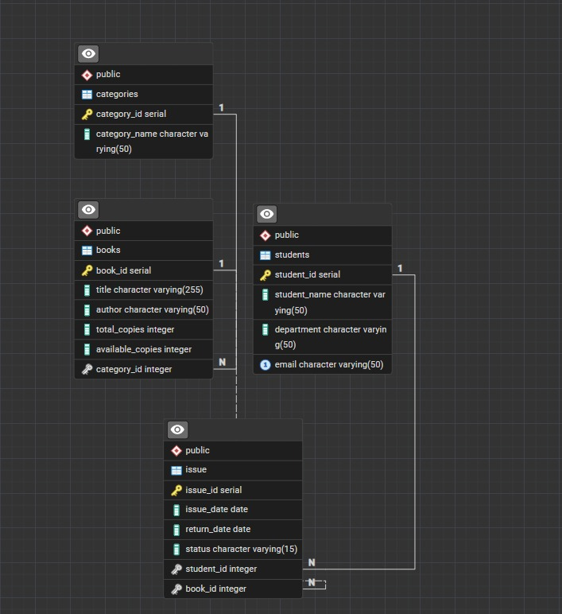

# 📚 Final_Round_Library_Dashboard

A full-stack database-driven **Library Analytical Dashboard** developed using PostgreSQL, FastAPI, HTML, CSS, JavaScript, and Chart.js. This project demonstrates database design, SQL analysis, REST API development, frontend integration, and data visualization through an interactive dashboard.


🌟 **Developer:** Prinkle Kella | **BS Software Engineering Student** | **June 2026**

---

## 🎯 Project Objective

The objective of this project was to build a complete database-driven analytical dashboard for library data. It focuses on database design, SQL reporting, API development, frontend integration, and visual analytics.

The system simulates a library environment where books, students, categories, and issue records are stored in PostgreSQL and displayed through a clean dashboard using charts, tables, and summary cards.

---

## 🛠️ Technologies Used

### Backend

* Python 3.12
* FastAPI
* Psycopg2
* Python Dotenv

### Database

* PostgreSQL
* Neon PostgreSQL

### Frontend

* HTML5
* CSS3
* JavaScript
* Chart.js

### Development Tools

* VS Code
* Git
* GitHub
* GitHub Codespaces
* LocalTunnel

---

## 🗄️ Database Overview

The project database contains the following main entities:

### Books

Stores book details such as title, author, category, total copies, and available copies.

### Students

Stores student information such as student name, department, and email.

### Categories

Stores book category names.

### Issue Records

Stores book issue transactions including issue date, return date, student, book, and issue status.

Status values used in the project:

* ISSUED
* RETURNED
* LATE

---

## 📊 Dashboard Features

### Summary Cards

The dashboard displays:

* Total Books
* Total Students
* Total Categories
* Total Issue Records
* Issued Books
* Returned Books
* Late Books
* Top Student

### Charts and Graphs

The dashboard includes:

* Books by Category Chart
* Issue Status Chart
* Top Students by Issued Books Chart
* Available vs Issued Copies Chart

### Tables

The frontend includes separate tables for:

* Books Data
* Issue Records
* Categories
* Issue Status Report
* Top Students Report
* Available Copies Report
* Complete Dashboard Log

---

## 📋 SQL Analytical Reports

### Books by Category Report

```sql
SELECT
c.category_name,
COUNT(b.book_id) AS total_books
FROM categories c
LEFT JOIN books b
ON c.category_id = b.category_id
GROUP BY c.category_name
ORDER BY total_books DESC;
```

### Issue Status Report

```sql
SELECT
status,
COUNT(*) AS total
FROM issue
GROUP BY status
ORDER BY total DESC;
```

### Top Students Report

```sql
SELECT
s.student_name,
COUNT(i.issue_id) AS total_issued
FROM students s
JOIN issue i
ON s.student_id = i.student_id
GROUP BY s.student_name
ORDER BY total_issued DESC
LIMIT 5;
```

### Complete Issue Report

```sql
SELECT
i.issue_id,
s.student_name,
s.department,
s.email,
b.title,
c.category_name,
i.issue_date,
i.return_date,
i.status
FROM issue i
JOIN students s
ON s.student_id = i.student_id
JOIN books b
ON b.book_id = i.book_id
JOIN categories c
ON c.category_id = b.category_id
ORDER BY i.issue_date DESC;
```

### Available Copies Report

```sql
SELECT
b.title,
c.category_name,
b.total_copies,
b.available_copies,
(b.total_copies - b.available_copies) AS issued_copies
FROM books b
JOIN categories c
ON b.category_id = c.category_id
ORDER BY issued_copies DESC;
```

---

## 🖥️ Frontend Modules

### Dashboard

Displays summary cards, charts, and complete dashboard logs.

### Books

Displays all books with category, author, total copies, and available copies.

### Issue Records

Displays complete book issue records.

### Categories

Displays category-wise book count.

### Reports

Displays analytical report tables.

---

## 📸 Screenshots

### ERD Diagram



Dashboard screenshots can be added later in the `screenshots` folder.

---

## 🚀 How to Run Locally

### Clone the Repository

```bash
git clone https://github.com/PrinkleMahshwari/final-round-library-dashboard.git
```

### Navigate to Project Directory

```bash
cd final-round-library-dashboard
```

### Create Virtual Environment

```bash
python -m venv venv
```

### Activate Virtual Environment

For Windows:

```bash
venv\Scripts\activate
```

For Linux / Mac:

```bash
source venv/bin/activate
```

### Install Dependencies

```bash
pip install -r backend/requirements.txt
```

---

## 🔐 Environment Variables

Create a local `.env` file in the project root directory.

Example:

```env
DATABASE_URL=your_postgresql_connection_string
```

> The `.env` file is not included in this repository because it contains private database credentials. It should remain ignored using `.gitignore`.

---

## ▶️ Run FastAPI Server

### From Backend Folder

```bash
cd backend
uvicorn main:app --host 0.0.0.0 --port 8000 --reload
```

### From Project Root

```bash
uvicorn backend.main:app --host 0.0.0.0 --port 8000 --reload
```

---

## 🌐 Temporary Public Preview Using LocalTunnel

This project is not deployed on Vercel, Render, Railway, or any permanent hosting platform yet.

During development, LocalTunnel was used to temporarily expose the FastAPI server publicly because the normal forwarded port was not accessible directly.

Run:

```bash
npx localtunnel --port 8000
```

Or use a custom subdomain:

```bash
npx localtunnel --port 8000 --subdomain prinkle-library-dashboard
```

Example temporary preview URL:

```text
https://rude-moth-64.loca.lt/
```

> This URL is temporary and only works while the FastAPI server and LocalTunnel command are running.

---

## ⚙️ Frontend API Configuration

The frontend automatically detects the current running URL:

```javascript
const API_BASE = window.location.origin;
```

This helps the frontend work with local development, Codespaces, or LocalTunnel without changing the API base URL again and again.

---

## 📂 Project Structure

```text
final-round-library-dashboard/
│
├── backend/
│   ├── main.py
│   └── requirements.txt
│
├── database/
│   ├── 01_schema.sql
│   ├── 02_insert.sql
│   └── 03_analysis_queries.sql
│
├── frontend/
│   ├── favicon.svg
│   ├── index.html
│   ├── style.css
│   └── script.js
│
├── screenshots/
│   └── library-erd.jpeg
│
├── .gitignore
└── README.md
```

---

## 📚 Skills Demonstrated

Through this project, I practiced and demonstrated:

* Database Design
* ERD Development
* PostgreSQL
* SQL Queries
* Analytical Reports
* REST API Development
* FastAPI Backend
* Frontend Development
* JavaScript API Integration
* Chart.js Data Visualization
* Responsive Dashboard UI
* Git & GitHub
* GitHub Codespaces
* LocalTunnel Testing

---

## 🚀 Future Improvements

Possible future improvements include:

* User Authentication
* Role-Based Access Control
* Add, Update, and Delete Operations
* Search and Filtering
* Export Reports to PDF
* Export Reports to Excel
* Dark Mode
* Permanent Backend Deployment
* Permanent Frontend Deployment
* Advanced Analytics Dashboard

---

## 🙏 Acknowledgements

This project was developed for learning, database practice, and final-round technical preparation.

Special thanks to:

* PostgreSQL Community
* FastAPI Community
* Chart.js Developers
* Neon PostgreSQL
* Open Source Contributors

---

## 👨‍💻 Author

**Prinkle Kella**

BS Software Engineering Student at SZABIST Karachi

* GitHub: [PrinkleMahshwari](https://github.com/PrinkleMahshwari)

---

## 🔎 SEO Keywords

`Library Dashboard`, `FastAPI Project`, `PostgreSQL Project`, `Database Dashboard`, `Chart.js Dashboard`, `SQL Analytics`, `Library Management System`, `Data Visualization`, `Full Stack Project`, `Database Design`, `GitHub Codespaces`, `Neon PostgreSQL`, `JavaScript Dashboard`, `FastAPI Backend`, `PostgreSQL Analytics`

<!-- Achievement Tracking: YOLO Badge Quest -->

